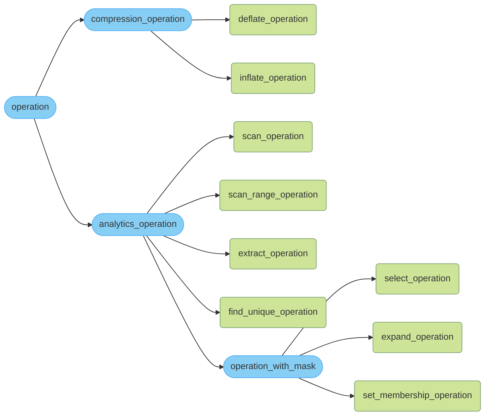
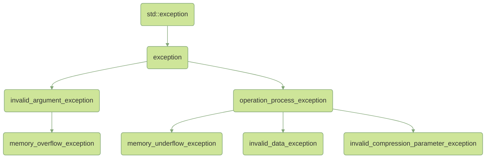

<!--
Copyright (C) 2022 Intel Corporation 
SPDX-License-Identifier: MIT
-->

Intel® Query Processing Library (Intel® QPL) Public C++ API Manual
===============================================================================

### Notices and Disclaimers

No license (express or implied, by estoppel or otherwise) to any intellectual
property rights is granted by this document.

Intel disclaims all express and implied warranties, including without
limitation, the implied warranties of merchantability, fitness for a particular
purpose, and non-infringement, as well as any warranty arising from course of
performance, course of dealing, or usage in trade. This document contains
information on products, services and/or processes in development. All
information provided here is subject to change without notice. Contact your
Intel representative to obtain the latest forecast, schedule, specifications and
roadmaps. The products and services described may contain defects or errors
which may cause deviations from published specifications. Current characterized
errata are available on request. Intel, the Intel logo, Intel Atom, Intel Core
and Xeon are trademarks of Intel Corporation in the U.S. and/or other countries.
\*Other names and brands may be claimed as the property of others. Microsoft,
Windows, and the Windows logo are trademarks, or registered trademarks of
Microsoft Corporation in the United States and/or other countries. Java is a
registered trademark of Oracle and/or its affiliates.

© Intel Corporation.

This software and the related documents are Intel copyrighted materials, and
your use of them is governed by the express license under which they were
provided to you ("License"). Unless the License provides otherwise, you may
not use, modify, copy, publish, distribute, disclose or transmit this software
or the related documents without Intel's prior written permission. This software
and the related documents are provided as is, with no express or implied
warranties, other than those that are expressly stated in the License.


# High Level API Developer Guide


### Integration into Other Projects

The library can be integrated into your project in two ways.

##### Integration into Any Build System

The `lib64` folder of `<install_dir>` contains the high-level API library called `libqplhl.a` (Linux* OS) or `qplhl.lib` (Windows*).
Link to `libqplhl.a` (Linux* OS) or `qplhl.lib` (Windows*) and specify correct include directory for you build system. After 
that you are ready to use the Intel QPL high-level API.

##### Integration into CMake-based Project

The library provides a specific CMake export file. To enable CMake integration, use the standard `find_package` function after library installation.  

A simple example of `CMakeLists.txt`:
```cmake
find_package(Qpl REQUIRED COMPONENTS qplhl)

add_executable(test main.cpp)
target_link_libraries(test Qpl::qplhl)
```

The Intel QPL library package consists of several components. High-level API component is called `qplhl` and is placed in the `Qpl::`namespace. To start using it, link to the component as it is shown in the example earlier.

##### Header Files

Header files for high-level API are in `include/qpl/cpp_api`. The application only needs to include one header file: “qpl/qpl.hpp”. It includes the entire API definition.

### Usage of the Intel QPL High-Level API

Table of contents:
 - [Abstraction layers](#abstraction-layers)
 - [Operation overview](#operation-overview)
    + [Inheritance hierarchy](#inheritance-hierarchy)
    + [Usage](#usage)
       * [Basic usage](#basic-usage)
       * [Advanced usage](#advanced-usage)
       * [Usage example](#usage-example)
    + [Operations](#operations)
       * [Compression operations](#compression-operations)
          - [Deflate](#deflate-operation)
          - [Inflate](#inflate-operation)
          - [Zero compress](#zero-compress-operation)
          - [Zero decompress](#zero-decompress-operation)
       * [Analytics operations](#analytics-operations)
          - [Scan](#scan-operation)
          - [Scan range](#scan-range-operation)
          - [Extract](#extract-operation)
          - [Find unique](#find-unique-operation)
       * [Operations with mask](#operations-with-mask)
          - [Select](#select-operation)
          - [Expand](#expand-operation)
          - [Set membership](#set-membership-operation)
       * [Custom operations](#custom-operations)
          - [Inheritance way](#inheritance-way)
          - [Lambda way](#lambda-way)
          - [Functor way](#functor-way)
       * [Other operations](#other-operations)
          - [Copy operation](#copy-operation)
          - [CRC operation](#crc-operation)
    + [Operations chaining](#operations-chaining)
       * [merge manipulator](#merge-manipulator)
       * [Chaining limitations](#chaining-limitations)
    + [Advanced operation configuration](#advanced-operation-configuration)
       * [Analytics operations methods](#analytics-operations-methods)
       * [Operations with mask methods](#operations-with-mask-methods)
       * [Methods description](#methods-description)
    + [How to set parser](#how-to-set-parser)
       * [Big Endian](#big-endian)
       * [Little Endian](#little-endian)
       * [Parquet RLE](#parquet-rle)
    + [Compression styles](#compression-styles)
       * [Dynamic blocks](#dynamic-blocks)
       * [Fixed block](#fixed-block)
       * [Static blocks](#static-blocks)
       * [Canned](#canned)
    + [Huffman table](#huffman-table)
       * [Collecting deflate statistics](#collecting-deflate-statistics)
       * [Building Huffman table](#building-huffman-table)
          - [Deflate Huffman table](#deflate-huffman-table)
          - [Inflate Huffman table](#inflate-huffman-table)
    + [Execution path](#execution-path) 
    + [Asynchronous execution](#asynchronous-execution)
       * [Overview](#overview)
       * [Advanced options](#advanced-options)
       * [Examples](#examples)
    + [Deflate block](#deflate-block)
       * [Deflate block overview](#deflate-block-overview)
       * [Building a block](#building-a-block)
       * [Random access to bytes](#random-access-to-bytes)
       * [Advanced options for the Deflate block](#advanced-options-for-the-deflate-block)
       * [Deflate block usage examples](#deflate-block-usage-examples)
 - [Compression stream overview](#compression-stream-overview)
    + [How to use compression stream](#how-to-use-compression-stream)
       * [Deflate stream](#deflate-stream)
       * [Inflate stream](#inflate-stream)
 - [Execution_result overview](#execution-result-overview)
    + [How to use execution_result](#how-to-use-execution-result)
       * [Common handling](#common-handling)
       * [Present handling](#present-handling)
       * [Absent handling](#absent-handling)
 - [Exception overview](#exception-overview)
    + [Inheritance hierarchy](#inheritance-hierarchy-1)
    + [Exceptions description](#exceptions-description)
    + [How to use exceptions](#how-to-use-exceptions)
       * [Exception handling examples](#exception-handling-examples)
       * [Exception throw example](#exception-throw-example)
 - [Hardware path optimizations](#hardware-path-optimizations)
    + [Multi descriptor submission] (#multi-descriptor-submission)


## Abstraction Layers

The Intel QPL high-level API consists of several abstraction layers:

 - [ ] Execution service
 - [x] Operation chain
 - [x] Operations

Execution service - ***TBD***


## Operation Overview

Operations in the Intel QPL high-level API are divided into two types:

 - `simple operation` - represents the available functionalities of the Intel QPL. They are the most low-level and configurable entities in this API. For more details, see the [Operations](#operations) section.
 - `operation chain` - is responsible for creating and executing the chain of operations. The chain can be created and then reused across the library. For more details, see the [Operations chaining](#operations-chaining) section.


### Inheritance Hierarchy




### Usage

Currently, Intel QPL high-level API contains limited Intel QPL functionality. 
Below you can find detailed description of all included operations and current limitations.

The library supports several ways to create an operation:

 - [Basic usage](#basic-usage) (using default parameters)
 - [Advanced usage](#advanced-usage) (advanced operation configuration)

To perform the operation, call the `qpl::execute()` method by passing the operation, input, and output streams to the parameters.  
The input data can be transferred in two ways, depending on the input data type:

```c++
// Iterators as input data
qpl::execute(deflate_operation, source.begin(), source.end(), destination.begin(), destination.end());

// Containers as input data
qpl::execute(deflate_operation, source, destination);
```

Method `execute()` returns class object `execution_result` containing status code and the number of elements produced in output buffer. For more details visit -> [Execution_result overview](#execution-result-overview). Here is an example:

```c++
auto result = qpl::execute(deflate_operation, source, destination);

result.handle([](uint32_t value) -> void
              {
                  std::cout << "Result size: " << value;
              }, [](uint32_t status) -> void
              {
                  throw std::runtime_error("Error: Status code - " + std::to_string(status));
              });
```

`qpl::execute()` method also has a template parameter, which specifies the allocator (default value `std::allocator<uint8_t>`) for the requested operation.   
If necessary, you can specify a custom allocator, for example:
```c++
auto result = qpl::execute<user::custom_allocator>(some_operation, input_container, output_container);
```

#### Basic Usage

```c++
auto operation = qpl::some_operation(some_required_parameter);
```

#### Advanced Usage

>>>
**Note:** This method is not applicable to operations such as `compression_operation`
>>>

```c++
auto operation = qpl::some_operation::builder()
        .some_parameter(value)
        .build()
```

A list of available methods and their description can be found in section [Advanced operation configuration](#advanced-operation-configuration).


#### Usage Example

The following example demonstrates how to use the deflate operation:

```c++
#include <qplhl/operations/deflate_operation.hpp>

int main()
{
    std::vector<uint8_t> source(1000, 5);
    std::vector<uint8_t> destination(500, 4);

    auto deflate_operation = qpl::deflate_operation();
    auto result            = qpl::execute(deflate_operation, source, destination);

    uint32_t result_size = 0;
    result.handle([&result_size](uint32_t value) -> void
                  {
                      result_size = value;
                  }, [](uint32_t status) -> void
                  {
                      throw std::runtime_error("Error: Status code - " + std::to_string(status));
                  });

    return 0;
}
```


### Operations

This section describes the Intel QPL high-level API operations.


#### Compression Operations
---------------------------


##### Deflate Operation

Deflate operation represents a compression functionality that uses the deflate compression algorithm. Currently, `qpl::deflate_operation` supports the following compression modes:

 - [Dynamic blocks](#dynamic-blocks)
 - [Fixed block](#fixed-block)
 - [Static blocks](#static-blocks)
 - [Canned](#canned)

It also supports two additional extensions like GZIP mode and high compression level (zlib level 9). Here is an example:

```c++
#include <qplhl/operations/deflate_operation.hpp>

// ...
auto deflate_operation             = qpl::deflate_operation();
auto deflate_gzip_operation        = qpl::deflate_operation::builder()
        .gzipMode(true)
        .build();
auto deflate_high_compression_level = qpl::deflate_operation::builder()
        .gzip_mode(false)
        .compression_level(qpl::compression_levels::high_level)
        .build();
auto deflate_fixed_compression_mode = qpl::deflate_operation::builder()
        .compression_mode<qpl::compression_modes::fixed_mode>()
        .build();
// ...
```


##### Inflate Operation

Inflate operation represents a decompression functionality that uses the inflate decompression algorithm. Currently, `qpl::inflate_operation` is not capable of
dynamic detection of GZIP mode, so GZIP mode should be explicitly set in factory method (GZIP mode is turned off by default).  
Here is an example of how to get the inflate operation:
```c++
#include <qplhl/operations/inflate_operation.hpp>

// ...
auto inflate_operation      = qpl::inflate_operation();
auto inflate_gzip_operation = qpl::inflate_operation::builder()
        .gzip_mode(true)
        .build();
// ...
```

To use the inflate operation in the canned mode, set the mode clearly and inflate Huffman table, like in the example:

```c++
#include <qplhl/operations/inflate_operation.hpp>

// ...
auto inflate_operation = qpl::inflate_operation::builder()
        .compression_mode<qpl::compression_modes::canned_mode>(inflate_table)
        .build();
// ...
```

##### Zero Compress Operation

Zero compress operation represents a zero compression functionality at either a 16-bit or a 32-bit granularity.

>>>
**Note:** This compression has nothing to do with `deflate`.
This is a very light-weight compression scheme that can be useful in certain circumstances.
>>>

Here is an example:

```c++
#include <qplhl/operations/compression/zero_compress_operation.hpp>

// ...
auto zero_compress_16_operation   = qpl::zero_compress_operation(qpl::zero_input_format::word_16_bit);
auto zero_compress_32_operation   = qpl::zero_compress_operation(qpl::zero_input_format::word_32_bit);
// ...
```

##### Zero Decompress Operation

Zero decompress operation represents a zero compression functionality at either a 16-bit or a 32-bit granularity.

Here is an example:

```c++
#include <qplhl/operations/compression/zero_decompress_operation.hpp>

// ...
auto zero_decompress_16_operation = qpl::zero_decompress_operation(qpl::zero_input_format::word_16_bit);
auto zero_decompress_32_operation = qpl::zero_decompress_operation(qpl::zero_input_format::word_32_bit);
// ...
```

#### Analytics Operations
-------------------------

##### Scan Operation

Scan operation represents a simple filtering function. Scan operation is responsible for extracting elements that satisfy 
the given condition (for example: less, greater, equal, not equal, etc.). Here is an example of how to get the scan operation:

```c++
#include <qplhl/operations/scan_operation.hpp>

// ...
constexpr const uint32_t boundary = 7;

auto scan_less_operation           = qpl::scan_operation(qpl::less, boundary);
auto scan_less_equals_operation    = qpl::scan_operation::builder(qpl::less, boundary)
        .is_inclusive(true)
        .build();
auto scan_greater_operation        = qpl::scan_operation(qpl::greater, boundary);
auto scan_greater_equals_operation = qpl::scan_operation::builder(qpl::greater, boundary)
        .is_inclusive(true)
        .build();
auto scan_equals_operation         = qpl::scan_operation(qpl::equals, boundary);
auto scan_not_equals_operation     = qpl::scan_operation(qpl::not_equals, boundary);
// ...
```

##### Scan Range Operation

Scan range operation is similar to the simple scan operation but it works with two boundaries (lower and upper):
```c++
#include <qplhl/operations/scan_range_operation.hpp>

// ...
constexpr const uint32_t lower_boundary = 48;
constexpr const uint32_t upper_boundary = 58;

auto in_range_operation     = qpl::scan_range_operation(lower_boundary, upper_boundary);
auto out_of_range_operation = qpl::scan_range_operation::builder(lower_boundary, upper_boundary)
        .is_inclusive(false)
        .build();
// ...
```

Family of `Scan` operations could become significantly faster on hardware path under some
conditions described in [Multi-descriptor processing](#multi-descriptor-processing) section.

##### Extract Operation

Extract operation performs an extraction from the source using two index boundaries (for example, extract everything from position
4 to position 123). Here is an example of how to get the extract operation:

```c++
#include <qplhl/operations/extract_operation.hpp>

// ...
constexpr const uint32_t lower_index = 4;
constexpr const uint32_t upper_index = 123;

auto operation = qpl::extract_operation(lower_index, upper_index);
// ...
```

##### Find Unique Operation

Find unique operation builds a set that can be used for previous `qpl::set_membership_operation` operation.

```c++
#include <qplhl/operations/find_unique_operation.hpp>

// ... 
auto find_unique_operation = qpl::find_unique_operation();
// ...
```


#### Operations with Mask
-------------------------

For all operations with the mask, you can leave the mask value as `nullptr` and the mask byte size equal to zero, and calculate the mask during chaining. For more details, see the [Operations chaining](#operations-chaining) section.

##### Select Operation

Select operation works with bit-mask as an addition to usual input and output buffers. This bit-mask should be specified while creating the operation, for example:

```c++
#include <qplhl/operations/select_operation.hpp>

// ...
const uint8_t *const mask = custom_method_to_build_mask();
const uint32_t mask_byte_size = custom_get_mask_size();
 
auto operation = qpl::select_operation(mask, mask_byte_size);
// ...
```

##### Expand Operation

Expand operation is another analytics operation that works with bit-mask as an addition to usual input and output buffers.
Since there is no way to build this bit-mask for the expand operation, you should pass this mask into the factory method, for example:

```c++
#include <qplhl/operations/expand_operation.hpp>

// ...
const uint8_t *const mask = custom_method_to_build_mask();
const uint32_t maskByteSize = custom_get_mask_size();

auto operation = qpl::expand_operation(mask, mask_byte_size);
// ...
```

Output vector width for `qpl::expand_operation` is the same as input vector bit width. Therefore, you can specify
the input vector width as the last parameter for constructor, for example:

```c++
#include <qplhl/operations/expand_operation.hpp>

// ...
const uint8_t *const mask = custom_method_to_build_mask();
const uint32_t mask_byte_size = custom_get_mask_size();

auto operation = qpl::expand_operation::builder(mask, mask_byte_size)
        .input_vector_width(3)
        .build();
// ...
```

##### Set Membership Operation

Set membership operation leaves in destination buffer just an element from the given set.
Set membership operation is another one analytics operation that works with bit-mask as an addition to usual input and output buffers.

```c++
#include <qplhl/operations/set_membership_operation.hpp>

// ...
const uint8_t *const mask = custom_method_to_build_mask();
const uint32_t mask_byte_size = custom_get_mask_size();
 
auto operation = qpl::set_membership_operation(mask, mask_byte_size);
// ...
```

'Set membership' operation could become significantly faster on hardware path under some
conditions described in [Multi-descriptor processing](#multi-descriptor-processing) section.

### Filtering Operation Optimization 

### Custom Operations

The library allows user to create a custom operation and then unite it with simple Intel QPL operations into the chain.
Three ways of creating a custom operation are supported. Those are described next.

##### Inheritance Way

The first option of creating a custom operation is inheritance from the appropriate interface called `custom_operation`.  

Example:
```c++
class my_operation : public qpl::custom_operation
{
public:
    auto execute(const uint8_t *source,
                 uint32_t source_size,
                 uint8_t *destination,
                 uint32_t destination_size) -> uint32_t override
    {
        if (source_size > destination_size)
        {
            throw std::length_error("Not enough output length");
        }

        for (uint32_t i = 0; i < source_size; i++)
        {
            destination[i] = source[i];
        }

        return source_size;
    }
};

// ...
auto custom_operation = my_operation();

auto chain = qpl::scan_operation(qpl::equals, 7) |
             qpl::select_operation() |
             custom_operation |
             qpl::deflate_operation() |
             qpl::inflate_operation();

qpl::execute(chain, source, destination);
// ...
``` 

##### Lambda Way

The second option is using simple lambdas. 

Example:
```c++
auto chain = qpl::scan_operation(qpl::equals, 7) |
             qpl::select_operation() |
             [](const uint8_t *source,
                uint32_t source_size,
                uint8_t *destination,
                uint32_t destination_size) -> uint32_t
             {
                 if (source_size > destination_size)
                 {
                     throw std::length_error("Not enough output length");
                 }

                 for (uint32_t i = 0; i < source_size; i++)
                 {
                     destination[i] = source[i];
                 }

                 return source_size;
             } |
             qpl::deflate_operation() |
             qpl::inflate_operation();

qpl::execute(chain, source, destination);
```
Please note, that passed lambda is required to accept four parameters (the same API as for previous option).

##### Functor Way

The last option is to pass any callable object that satisfies the requirements on passed arguments into the chain(they are listed in the first option).

Example:

```c++
struct custom_functor
{
    auto operator()(const uint8_t *source,
                    uint32_t source_size,
                    uint8_t *destination,
                    uint32_t destination_size) -> uint32_t
    {
        if (source_size > destination_size)
        {
            throw std::length_error("Not enough output length");
        }

        for (uint32_t i = 0; i < source_size; i++)
        {
            destination[i] = source[i];
        }

        return source_size;
    }
};

// ...
auto chain = qpl::scan_operation(qpl::equals, 7) |
             qpl::select_operation() |
             custom_functor() |
             qpl::deflate_operation() |
             qpl::inflate_operation();

qpl::execute(chain, source, destination);
// ...
```

#### Other Operations
-------------------------

##### Copy Operation

The copy operation performs a simple memory copy. The application defines the input buffer and the output buffer.
The output buffer must be at least as large as the input buffer, and the two buffers cannot overlap.

Example:
```c++
#include <qplhl/operations/other/copy_operation.hpp>

// ...
auto copy_operation = qpl::copy_operation();
// ...
``` 

##### CRC Operation

This operation computes an arbitrary CRC up to 64-bytes in size.

>>>
**Note:** For this operation `bit_order` supports only `little_endian_packed_array` and `big_endian_packed_array` parsers.
>>>

Example:

```c++
#include <qplhl/operations/other/crc_operation.hpp>

// ...
constexpr const uint64_t poly = 0x04C11DB700000000;

auto crc_operation = qpl::crc_operation::builder(poly)
        .bit_order<qpl::parsers::little_endian_packed_array>()
        .is_inverse(false)
        .build();
// ...
``` 

### Operations Chaining

One of the main features of Intel QPL is a capability to build custom chains of operations. For example, if you need to perform operations ``decompress -> filter -> extract``, use chaining functionality instead of simple operations abstraction level. To do this, include the header file called `<qplhl/chaining/operation_chain.hpp>` and then you will be able to chain Intel QPL operations like this:

```c++
#include <qplhl/chaining/operation_chain.hpp>
#include <qplhl/operations/inflate_operation.hpp>
#include <qplhl/operations/scan_range_operation.hpp>
#include <qplhl/operations/select_operation.hpp>
// ...
constexpr const uint32_t lower_boundary = 48;
constexpr const uint32_t upper_boundary = 58;

auto chain = qpl::inflate_operation() |
             qpl::scan_range_operation(lower_boundary, upper_boundary) |
             qpl::select_operation();

// ...
```

An overloaded operator `|` for Intel QPL operations constructs specific object `qpl::operation_chain`. Use of an object of this
class is the same as of a simple operation.

```c++
// ...
std::vector source(/*...*/);
std::vector destination(/*...*/);

auto result = qpl::execute(chain, source, destination);
// ...
```

If you need to create an `qpl::operation_chain` with custom allocator (will be used for allocation of temporary buffers
and result buffer), pass additional template parameter to `qpl::execute()` function like this:

```c++
// ...
auto chain = qpl::inflate_operation() |
             qpl::scan_range_operation(lower_boundary, upper_boundary) |
             qpl::select_operation();

auto result = qpl::execute<allocator_t>(chain, source, destination);
// ...
```

After you chain your operation, you will not be able to use it anywhere else.

#### merge Manipulator

For some chain use cases, you can merge decompression and analytics operations into one. Such operation is able to perform both actions. To do this, add `qpl::merge` to chain as shown in the following example:

```c++
#include <qplhl/chaining/operation_chain.hpp>
#include <qplhl/chaining/merge_manipulator.hpp>
#include <qplhl/operations/inflate_operation.hpp>
#include <qplhl/operations/scan_range_operation.hpp>
// ...
constexpr const uint32_t lower_boundary = 48;
constexpr const uint32_t upper_boundary = 58;
constexpr const uint32_t number_of_decompressed_elements = 1000;

auto chain = qpl::inflate_operation() |
             qpl::merge(number_of_decompressed_elements) |
             qpl::scan_range_operation(lower_boundary, upper_boundary);
// ...
```

The `qpl::merge` constructor takes number of elements that should be processed after decompression as an argument.

`qpl::merge` should be placed:

- After decompression operation
- Before analytics operation that doesn't use mask

Adding `qpl::select_operation` and `qpl::set_membership_operation` to a chain right after merged operations makes no sense since the mask for these operations is calculated during chain execution.


#### Chaining Limitations

Intel QPL has some limitations for operations chaining. Here is the list of such limitations:

 - `qpl::find_unique_operation` is always the last operation in an Intel QPL chain, since there is no operation that can produce something useful after it.
 - All allocations are performed in the first execution call of the chain (should not really affect the performance).
 - Even if you specify a custom builder for any analytics operation, `qpl::operation_chain` can change input vector width of any operation in the chain to be able to continue the execution.

 **Note** In case if you discover some other limitations or you would like to remove one of already known limitations - please, don't
 hesitate to tell us about it.


### Advanced Operation Configuration

This section contains a list of supported methods and their description for configuring Intel QPL operations.


#### Analytics Operations Methods

<table>
  <tr>
    <th><i>Operation</i></th>
    <th><i>Common methods</i></th>
    <th><i>Specific methods</i></th>
  </tr>
  <tr>
    <td><b>scan_operation</b></td>
    <td rowspan="4"><code>output_vector_width(uint32_t value)</code><br><code>input_vector_width(uint32_t value)</code><br><code>parser(size_t number_of_input_elements)</code></td>
    <td><code>comparator(Comparators value)</code><br><code>boundary(uint32_t value)</code><br><code>is_inclusive(bool value)</code></td>
  </tr>
  <tr>
    <td><b>scan_range_operation</b></td>
    <td><code>lower_boundary(uint32_t value)</code><br><code>upper_boundary(uint32_t value)</code><br><code>is_inclusive(bool value)</code></td>
  </tr>
  <tr>
    <td><b>extract_operation</b></td>
    <td><code>lower_index(uint32_t value)</code><br><code>upper_index(uint32_t value)</code></td>
  </tr>
  <tr>
    <td><b>find_unique_operation</b></td>
    <td><code>number_low_order_bits_to_ignore(uint32_t value)</code><br><code>number_high_order_bits_to_ignore(uint32_t value)</code></td>
  </tr>
</table>

#### Operations with Mask Methods

<table>
  <tr>
    <th><i>Operation</i></th>
    <th><i>Common methods</i></th>
    <th><i>Specific methods</i></th>
  </tr>
  <tr>
    <td><b>select_operation</b></td>
    <td rowspan="3"><code>mask(const uint8_t *mask, size_t maskByteLength)</code><br><code>output_vector_width(uint32_t value)</code><br><code>input_vector_width(uint32_t value)</code><br><code>parser(size_t number_of_input_elements)</code></td>
    <td>-</td>
  </tr>
  <tr>
    <td><b>expand_operation</b></td>
    <td>-</td>
  </tr>
  <tr>
    <td><b>set_membership_operation</b></td>
    <td><code>number_low_order_bits_to_ignore(uint32_t value)</code><br><code>number_high_order_bits_to_ignore(uint32_t value)</code><br></td>
  </tr>
</table>

#### Methods Description


|                     **Method**                            |                         **Description**                         |
| :-------------------------------------------------------- | :-------------------------------------------------------------- |
|  `mask(const uint8_t *mask, size_t maskByteLength)`       |                Sets mask value and mask byte size               |
|          `output_vector_width(uint32_t value)`            |          Sets bit width of one element in output buffer         |
|          `input_vector_width(uint32_t value)`             |          Sets bit width of one element in input buffer          |
|            `comparator(Comparators value)`                |                  Sets operation compare filter                  |
|              `boundary(uint32_t value)`                   |               Sets the boundary for the analytics               |
|               `is_inclusive(bool value)`                  |        Sets "in-range" or "not-in-range" filter operation       |
|            `lower_boundary(uint32_t value)`               |             Sets lower boundary for scan operations             |
|            `upper_boundary(uint32_t value)`               |             Sets upper boundary for scan operations             |
|             `lower_index(uint32_t value)`                 |             Sets lower index for extract operations             |
|             `upper_index(uint32_t value)`                 |             Sets upper index for extract operations             |
|     `number_low_order_bits_to_ignore(uint32_t value)`     |               Sets number low order bits to ignore              |
|     `number_high_order_bits_to_ignore(uint32_t value)`    |              Sets number high order bits to ignore              |


#### How to Set Parser

Supports three types of parsers:
 - `big_endian_packed_array`
 - `little_endian_packed_array`
 - `parquet_rle`

The examples of how to use them are below.

##### Big Endian

```c++
auto number_input_elements = get_number_input_elements();

auto operation = qpl::some_operation::builder()
        .parser<qpl::parsers::big_endian_packed_array>(number_input_elements)
        .build()
```

##### Little Endian

```c++
auto number_input_elements = get_number_input_elements();

auto operation = qpl::some_operation::builder()
        .parser<qpl::parsers::little_endian_packed_array>(number_input_elements)
        .build()
```

##### Parquet RLE

>>>
**Note:** For parser `parquet_rle`, you must specify the number of input elements for analytics.
>>>

```c++
auto number_input_elements = get_number_input_elements();

auto operation = qpl::some_operation::builder()
        .parser<qpl::parsers::parquet_rle>(number_input_elements)
        .build()
```

#### Compression Styles

The library supports three types of compression styles:
 - `dynamic_mode`
 - `static_mode`
 - `fixed_mode`

The examples of how to use them are described in the next sections.

##### Dynamic Blocks

This is a default compression style that compresses data as a single dynamic deflate block.
This way gives the best compression ratio, but it requires two passes through the hardware.

Example of usage:
```c++
auto compression_operation = qpl::compression_operation::builder()
        .compression_mode<qpl::compression_modes::dynamic_mode>()
        .build()
```

##### Fixed Block

The simplest compression style is to generate one large fixed block.

Example of usage:
```c++
auto compression_operation = qpl::compression_operation::builder()
        .compression_mode<qpl::compression_modes::fixed_mode>()
        .build()
```

##### Static Blocks

This compression style is similar to the Fixed block, but with the possibility to specify the own Huffman table.
This style gives the application the ability to change the Huffman table in the middle of the stream.
If the stream is compressed with multiple tasks, the application can specify a different Huffman table in the middle of the stream.

>>>
**Note:** For the `static_mode`compression mode, you must specify the object with filled Huffman table (see section [Huffman table](#huffman-table) for more information)
>>>

Example of usage:

```c++
std::vector<uint8_t> source(1000, 5);

auto path = qpl::execution_path::software;

qpl::deflate_histogram deflate_histogram;

qpl::update_deflate_statistics<path>(source.begin(), source.end(), deflate_histogram, compression_levels::default_level);

auto deflate_huffman_table = qpl::make_deflate_table<path>(deflate_histogram);

auto compression_operation = qpl::deflate_operation::builder()
        .compression_mode<qpl::compression_modes::static_mode>(deflate_huffman_table)
        .build()

// ...
// Execute and handle operation result
//...
```

##### Canned

Compression with canned mode is almost like static style compression, but no deflate header is written to the output stream.
So, to use it, the valid deflate Huffman table should be set in the operation.
This approach is particularly good for compressing the series of small data, so the compression ratio for every block is expected to be higher.

To decompress such stream, the valid inflate Huffman table should be set in the operation. For better clarity, see canned mode example:

```c++

std::vector<uint8_t> source(1000, 5);

auto path = qpl::execution_path::software;

qpl::deflate_histogram deflate_histogram;

qpl::update_deflate_statistics<path>(source.begin(), source.end(), deflate_histogram, compression_levels::default_level);

auto deflate_huffman_table = qpl::make_deflate_table<path>(deflate_histogram);

auto compression_operation = qpl::deflate_operation::builder()
        .compression_mode<qpl::compression_modes::canned_mode>(deflate_huffman_table)
        .build()

// ...
// Execute and handle compression operation result
// ...

auto inflate_huffman_table = qpl::make_inflate_table<path>(deflate_huffman_table);

auto decompression_operation = qpl::inflate_operation::builder()
        .compression_mode<qpl::compression_modes::canned_mode>(inflate_huffman_table)
        .build()

// ...
// Execute and handle decompression operation result
// ...
```

#### Huffman Table

Creating a Huffman table consists of two steps:
 - Collecting deflate statistics
 - Building a Huffman table using statistics from the previous step

##### Collecting Deflate Statistics

Deflate statistics (or deflate histogram) represents metadata used for compression and decompression.
The function ``update_deflate_statistics`` processes given input data and updates the deflate histogram:

```c++
#include <qplhl/operations/deflate_operation.hpp>
// ...

std::vector<uint8_t> source(1000, 5);

qpl::deflate_histogram deflate_histogram; // Create empty deflate histogram

compression_levels level = compression_levels::default_level; // Set compression level for algorithm, that collects statistics

qpl::update_deflate_statistics<qpl::execution_path::software>(source.begin(), source.end(), deflate_histogram, level);
```

As a result, code example earlier will process `source` and store statistics to `deflate_histogram`.


##### Building Huffman Table

Two representations for Huffman Table are available: one for the use with the `deflate_operation`, and one for the use with the `inflate_operation`. The inflate Huffman table is only needed for certain advanced use cases, for example, canned mode compression.


###### Deflate Huffman table

To create a deflate Huffman table, use the following function:

```c++
// Use the deflate histogram from the previous section
auto deflate_huffman_table = qpl::make_deflate_table<qpl::execution_path::software>(histogram);
auto deflate_huffman_table = qpl::make_deflate_table<qpl::execution_path::hardware>(histogram);
auto deflate_huffman_table = qpl::make_deflate_table<qpl::execution_path::auto_detect>(histogram);
```

###### Inflate Huffman table


To create a inflate Huffman table, use the following function:

```c++
// Use a deflate huffman table
auto inflate_huffman_table = qpl::make_inflate_table<qpl::execution_path::software>(deflate_huffman_table);
auto inflate_huffman_table = qpl::make_inflate_table<qpl::execution_path::hardware>(deflate_huffman_table);
auto inflate_huffman_table = qpl::make_inflate_table<qpl::execution_path::auto_detect>(deflate_huffman_table);
```


### Execution Path

To select the execution path, specify a suitable template parameter for execution.  
By default, this is Software. This feature is available for both operations and chains. See the following examples:  

``` cpp
// ...

std::vector<uint8_t> source(/*...*/);
std::vector<uint8_t> destination(/*...*/);

auto chain = qpl::scan_range_operation(48, 58) |
             qpl::select_operation();

auto result = qpl::execute<qpl::hardware>(chain, source, destination);

// ...
```

``` cpp
// ...

std::vector<uint8_t> source("..."); 
std::vector<uint8_t> destination("...");

auto operation = qpl::deflate_operation();

auto result = qpl::execute<qpl::hardware>(operation, source, destination);

// ...
```

Two models are currently available:

- `qpl::hardware`  Execution on hardware
- `qpl::software`  Execution on the software library


### Asynchronous Execution


#### Overview

An operation or a chain сan be performed asynchronously in using `qpl::submit()` function for operation submission.

**Note** Asyncronous execution in C++ API is work in progress. Current implementation uses `qpl::execute()` function.

> qpl::submit() returns the qpl::execution_result<uint32_t, qpl::sync> object before the operation is completed.

> Currently, qpl::submit always returns qpl::execution_result<uint32_t, qpl::sync> which holds a number of elements processed to the destination.


### Deflate Block


#### Deflate Block Overview

The Deflate block is a representation of a DEFLATE stream, which allows the library for “random access” in the middle of the stream. The main idea is to split uncompressed data for fixed-size mini-blocks that can be decompressed independently. The size of the mini-blocks is a power of 2 from 512 through 32768.

With this approach, when accessing one particular uncompressed byte, only the mini-block containing that byte is decompressed.

**Note** that the smaller the mini-block is, the less work is needed to access any particular byte. On the other hand, the smaller the mini-blocks become, the worse the compression ratio becomes. So an application needs to make a reasonable trade-off between having the mini-blocks be too small or too large. To evaluate compression ratio, use the `deflate_block::compressedSize()` method.


#### Building a Block

To build a `deflate_block`, use the function `build_deflate_block()`. The function takes configured `deflate_operation`, input iterators, and mini-block size as input. The function outputs the `deflate_block` with the compressed stream. See the following example:

```cpp
#include <operations/compression/deflate_operation.hpp>

// ...

std::vector<uint8_t> source(/*...*/);

auto result = build_deflate_block(qpl::deflate_operation,
                                source.begin(),
                                source.end(),
                                qpl::mini_block_size_1k);

// ...
```

> Note that the deflate_block does not support CANNED compression mode.


#### Random Access to bytes

To access one particular uncompressed byte, call `deflate_block::operator[]` with the index of an element in the uncompressed stream.  When accessing one particular uncompressed byte only the mini-block containing that byte is decompressed and saved to the internal buffer. All subsequent requests that do not go beyond this mini-block work with the buffer and do not call a decompression until a new block is decompressed.

**Note** that `deflate_block` is a read-only object and a subscript operator returns only the copy of an element.

```cpp
// ...

auto deflate_block = qpl::build_deflate_block(/* ... */);

for (size_t i = startIndex; i < endIndex; i++)
{
	std::cout << deflate_block[i];
}

// ...
```


#### Advanced Options for the Deflate Block


##### Execution Path

`execution_path` for the `deflate_block` can be specified by the appropriate template parameter of the `qpl::build_deflate_block`. This path is used for building the `deflate_block` and for future `deflate_block::operator[]` requests.

```cpp
// ...

auto deflate_block = qpl::build_deflate_block<qpl::HARDWARE>(/* ... */);

// ...
```

##### allocator_t

You can provide a custom allocator for the `deflate_block` using the `template<class> allocator_t` template parameter. 

```cpp
// ...

auto deflate_block = qpl::build_deflate_block<qpl::software, std::allocator>(/* ... */);

// ...
```

#### Deflate Block Usage Examples

```cpp
#include <operations/compression/deflate_operation.hpp>
#include <results/deflate_block.hpp>

// ...

std::vector<uint8_t> source(/*...*/);
std::vector<uint8_t> subset;

auto result = qpl::build_deflate_block(qpl::deflate_operation,
                                       source.begin(),
                                       source.end(),
                                       qpl::MINI_BLOCK_SIZE_4k);

std::cout << "Size of the compressed stream: " << result.compressedSize() << "\n";

for (size_t i = startIndex; i < result.size(); i++)
{
	subset.push_back(result[i]);
}

// ...
```


## Compression Stream Overview

The library implements compression stream processing allowing the user to process input data by chunks.   
This functionality is available for two types of compression streams:

 - `qpl::deflate_stream` - responsible for compression by chunks
 - `qpl::inflate_stream` - responsible for decompression by chunks

Each stream has its own set of methods for processing input data.   
For more details, see the [How to use compression stream](#how-to-use-compression-stream).


### How to Use Compression Stream

See common methods for compression streams:

```c++
/**
 * @brief Method that returns an iterator pointing to the first element in the buffer
 */
auto begin() noexcept -> uint8_t *;

/**
 * @brief Method that returns an iterator pointing to the past-the-end element in the buffer
 */
auto end() noexcept -> uint8_t *;

/**
 * @brief Method that returns the number of elements in the buffer
 */
auto size() noexcept -> size_t;
```

#### Deflate Stream

See two main methods for processing input data for the `qpl::deflate_stream`:

```c++
template<class input_iterator_t>
auto push(const input_iterator_t &source_begin,
          const input_iterator_t &source_end) -> deflate_stream &;

template<class input_iterator_t>
void flush(const input_iterator_t &source_begin,
           const input_iterator_t &source_end) noexcept;
```

Using the `push()` method described earlier, `qpl::deflate_stream` accepts new chunks of the input stream for compression.   
After all the chunks are delivered, using the `flush()` method, it is necessary to send the very last chunk of the input stream for processing.


##### Simple Use Example

```c++
#include <qplhl/results/deflate_stream.hpp>

int main()
{
    std::vector<uint8_t> source(1000, 5);
    std::vector<uint8_t> destination(500, 4);

    auto deflate_operation = qpl::deflate_operation();
    auto deflate_stream    = qpl::deflate_stream(deflate_operation,
                                                 destination.size());
    
    deflate_stream.push(source.begin() + 0, source.begin() + 500)
                 .flush(source.begin() + 500, source.begin() + 1000);

    return 0;
}
```

The destination buffer might become full and further decompression will be impossible.   
Then, it is possible to catch exceptions of a specific type `qpl::short_destination_exception` and reassign the new output buffer using:

```c++
void resize(size_t new_size) noexcept;
```

>>>
**Note:** If `new_size` is smaller, than then current buffer size, the content is reduced to its first `new_size` elements, removing those beyond (and destroying them).
>>>
>>>
**Note:** If `new_size` is equal to the current buffer size, no copying is performed.
>>>

##### Example of Use with a Reset of Buffer

```c++
#include <qplhl/results/inflate_stream.hpp>

int main()
{
    std::vector<uint8_t> source(1000, 5);
    std::vector<uint8_t> destination(500, 4);
    std::vector<uint8_t> short_destination(10, 4);

    auto deflate_operation = qpl::deflate_operation();
    auto deflate_stream    = qpl::deflate_stream(deflate_operation,
                                                 short_destination.size());
    
    try
    {
        deflate_stream.push(source.begin() + 0, source.begin() + 500);
    } catch (qpl::short_destination_exception &e)
    {
        deflate_stream.reset(destination.size());
        deflate_stream.push(source.begin() + 0, source.begin() + 500);
    }

    deflate_stream.flush(source.begin() + 500, source.begin() + 1000);

    return 0;
}
```


#### Inflate Stream

The main method for processing input data for the `qpl::inflate_stream`:

```c++
template<class output_iterator_t>
auto extract(const output_iterator_t &destination_begin,
             const output_iterator_t &destination_end) -> inflate_stream &;
```

Using the `extract()` method described earlier, `qpl::inflate_stream` decompresses the data into the specified buffer.


##### Simple Use Example
```c++
#include <qplhl/results/inflate_stream.hpp>

int main()
{
    std::vector<uint8_t> reference(1000, 5);
    std::vector<uint8_t> destination(500, 4);

    auto inflate_operation = qpl::inflate_operation();
    auto inflate_stream    = qpl::inflate_stream(inflate_operation,
                                                 destination.begin(),
                                                 destination.end());
    
    inflate_stream.extract(reference.begin() + 0, reference.begin() + 500)
             .extract(reference.begin() + 500, reference.begin() + 1000);

    return 0;
}
```

## Execution Result Overview

The `qpl::execution_result` class represents the result of synchronous or asynchronous execution.

The library supports two ways to create an object of this class:

 1) Constructor for synchronous execution:
    ```c++
    template<class result_t>
    constexpr explicit execution_result(uint32_t status, result_t result)
            : status_(status),
              result_(std::move(result))
    {
        ...
    }
    ```

 2) Constructor for asynchronous execution:
    ```c++
    template<class result_t>
    constexpr explicit execution_result(const std::shared_future<result_t> &future)
            : future_(future)
    {
        // Empty constructor
    }
    ```

>>>
**Note:** result_t - type of the kept value
>>>


### How to Use execution_result

Class contains three methods of handling a result of execution:

 1) [Common handling](#common-handling) method:
    ```c++
    template<class present_statement_t, class absent_statement_t>
    void handle(present_statement_t present_statement, absent_statement_t absent_statement) const;
    ```
 2) [Present handling](#present-handling) method:
    ```c++
    template<class present_statement_t>
    void if_present(present_statement_t present_statement) const;
    ```
 3) [Absent handling](#absent-handling) method:
    ```c++
    template<class absent_statement_t>
    void if_absent(absent_statement_t absent_statement) const;
    ```

>>>
**Note:** 
`present_statement` - lambda function with action to be performed when the status is zero.  
`absent_statement` - lambda function with action to be performed when the status is not zero.
>>>


#### Common Handling

Method that performs the given actions depending on status:

```c++
...
result.handle([](uint32_t value) -> void
              {
                  std::cout << "Result size: " << value << std::endl;
              }, [](uint32_t status) -> void
              {
                  throw std::runtime_error("Error: Status code - " + std::to_string(status));
              });
...
```


#### Present Handling

Method that performs the given action if the result was present:

```c++
...
result.if_present([](uint32_t value) -> void
                 {
                     std::cout << "Result size: " << value << std::endl;
                 });
...
```

#### Absent Handling

Method that performs the given action if the result was absent:

```c++
...
result.if_absent([](uint32_t value) -> void
                {
                    throw std::runtime_error("Error: Status code - " + std::to_string(status));
                });
...
```


## Exception Overview

The high-level API implements its own exception system, which is based on `std::exception`.  
For more details, see the [How to use exceptions](#how-to-use-exceptions).


### Inheritance Hierarchy




### Exceptions Description

| **Name** | **Description** | **Class name** |
| ------ | ------ | ------ |
| *exception* | An std::exception analog for the Intel QPL | `qpl::exception` |
| *Invalid Argument Exception* | Thrown when initialization of an operation is incorrect | `qpl::invalid_argument_exception` |
| *Operation Process Exception* | Thrown when Buffer exceeds max size supported by hardware | `qpl::operation_process_exception` |
| *Memory Overflow Exception* | Thrown in case of an exception occurs during an operation | `qpl::memory_overflow_exception` |
| *Memory Underflow Exception* | Thrown when one of buffers is too small to finish operation's execution | `qpl::memory_underflow_exception` |
| *Invalid Data Exception* | Thrown in case of invalid Compression parameter | `qpl::invalid_data_exception` |
| *Invalid Compression Parameter Exception* | Thrown when an operation is attempted with incorrect input parameters, such as an incorrect stream to decompress | `qpl::invalid_compression_parameter_exception` |
| *Short Destination Exception* | Thrown when the destination buffer is too small to finish the execution. Can be handled by destination buffer extending | `qpl::short_destination_exception` |


### How to Use Exceptions

The main method inherent in all exceptions is `char* what()`, which allows you to view an error message.  
You can catch exceptions of a specific type like `qpl::invalid_argument_exception`, as well as all exceptions inherited from the specified type like `qpl::invalid_argument_exception &`.


#### Exception Handling Examples

 - only exceptions of specific type

```c++
#include <qplhl/util/exceptions.hpp>

int main()
{
    try
    {
        // Some code that may throw an invalid_argument_exception
    }
    catch(qpl::invalid_argument_exception e)
    {
        std::cerr << e.what() << std::endl;
    }
}
```

 - the whole exceptions tree of a selected type  

```c++
#include <qplhl/util/exceptions.hpp>

int main()
{
    try
    {
        // Some code that may throw an invalid_argument_exception or its descendants
    }
    catch(qpl::invalid_argument_exception &e)
    {
        std::cerr << e.what() << std::endl;
    }
}
```


#### Exception Throw Example

```c++
#include <qplhl/util/exceptions.hpp>

int main()
{
    try
    {
        ...
        throw invalid_data_exception("Invalid Huffman table");
    }
    catch(qpl::operation_process_exception &e)
    {
        std::cerr << e.what() << std::endl;
    }
}
```


## Hardware Path Optimizations

The following section contains information about optimizations for hardware path supported by Intel QPL.


Multi-Descriptor Processing
---------------------------

The library is able to split `Set membership` and `Scan` operations onto several sub-tasks and
performing them in paralleled mode. In other words, if the following conditions are met:
* This is `Set membership` or `Scan` (`Scan range`) operation
* Nominal bit array output, i.e. no output modifications
* Input data size is at least 32kB large
* Input is in Little- or Big-Endian format (no encoded input support)
* No more than 1 work queue per 1 device configured

Then the operation is auto-paralleled on the library level during execution on hardware path. This is intended to
receive better performance when processing large streams.
