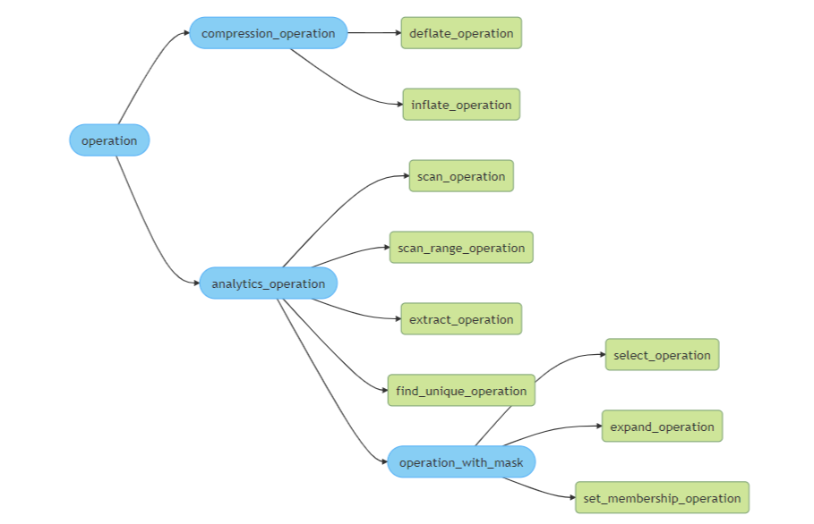

 .. ***************************************************************************
 .. * Copyright (C) 2022 Intel Corporation
 .. *
 .. * SPDX-License-Identifier: MIT
 .. ***************************************************************************/

.. _operations_reference_link:

Operations
##########

This section describes the Intel® Query Processing Library (Intel® QPL) 
high-level API operations.

Operation Overview
******************

Operations in the Intel QPL high-level API are divided into two types:

-  ``simple operation`` - represents the available functionalities of
   the Intel QPL. They are the most low-level and configurable entities
   in this API. For more details, see the :ref:`Operations 
   <operations_reference_link>` section.
-  ``operation chain`` - is responsible for creating and executing the
   chain of operations. The chain can be created and then reused across
   the library. For more details, see the :ref:`Operations
   chaining <operations_chaining_reference_link>` section.

Operation Inheritance Hierarchy
*******************************

  Inheritance Hierarchy

.. toctree::
    :maxdepth: 4

    compression_operations/index_compression_operations
    analytics_operations/index_analytics_operations
    mask_operations/index_mask_operations

    copy_operation
    crc_operation
